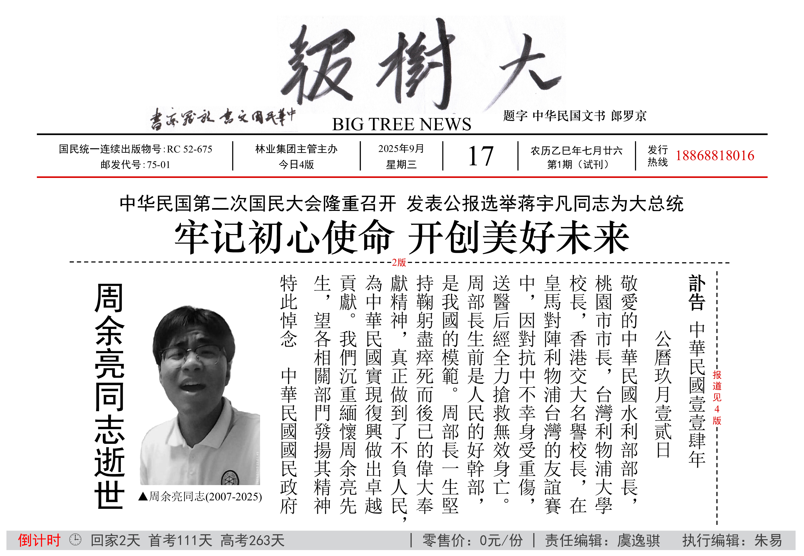
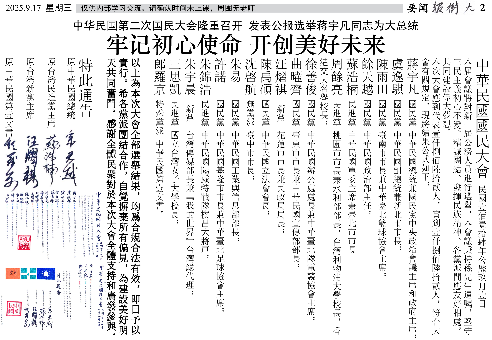
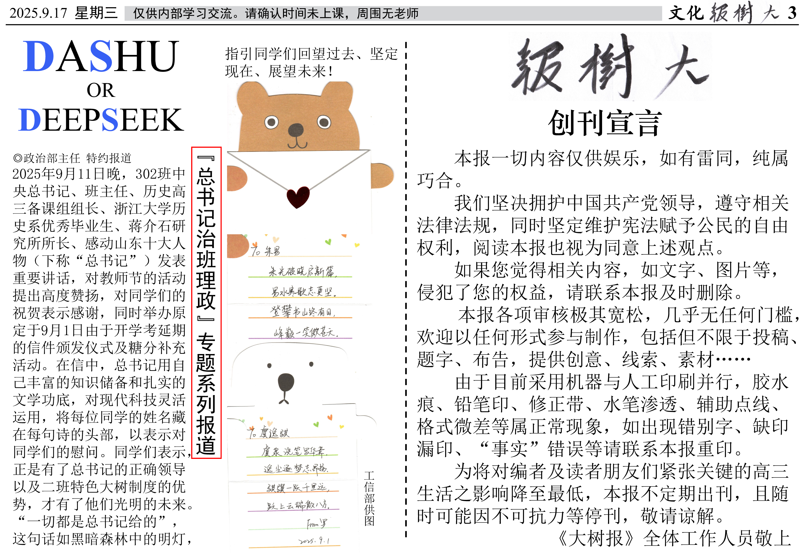
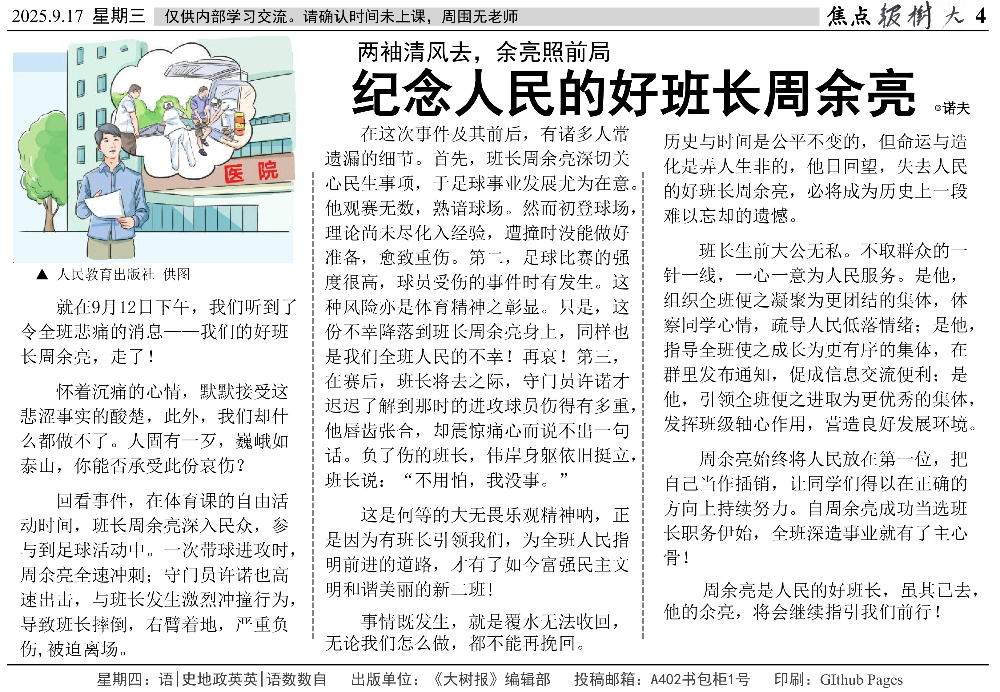

# 第1期
2025年9月17日 星期三 农历乙巳年七月廿六
::: details 今日4版
文章数：5

字符数：2366（不含页眉页脚）

图片数：12
:::
:::info 倒计时 & 课表预报
回家2天 首考111天 高考263天

星期四：语|史地政英英|语数数自
:::
## 1版：要闻
### 周余亮同志逝世
@中華民國國民政府

字符数：213

图片数：1

## 2版：要闻
### 中华民国第二次国民大会隆重召开 发表公报选举蒋宇凡同志为大总统
### 牢记初心使命 开创美好未来
@中華民國國民政府

字符数：661

图片数：6

## 3版：文化
### “总书记治班理政”专题系列报道
### DASHU OR DEEPSEEK
@政治部主任

字符数：322

图片数：3
### 《大树报》创刊宣言
@《大树报》编辑部

字符数：318

图片数：1

## 4版：焦点
### 两袖清风去，余亮照前局
### 纪念人民的好班长周余亮
@诺夫

字符数：864

图片数：1
