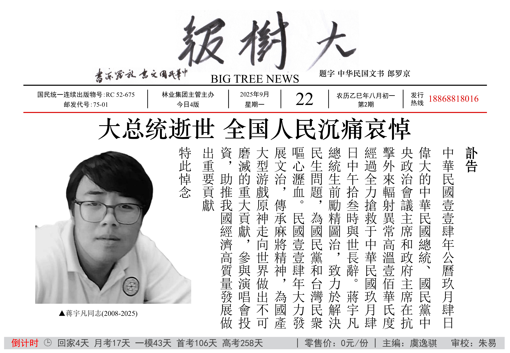
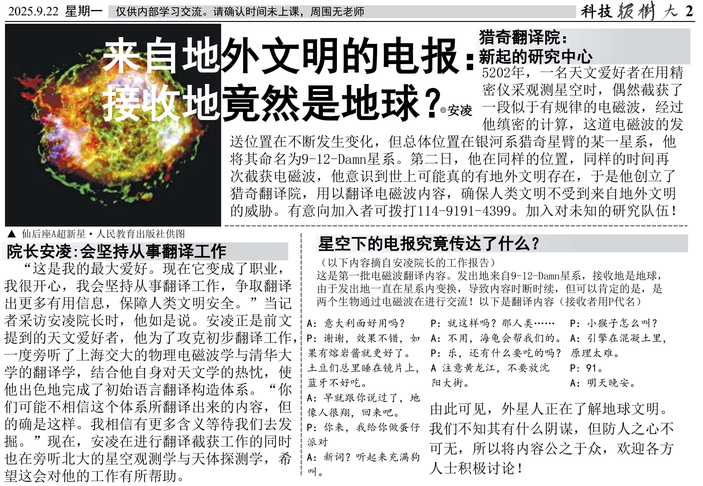
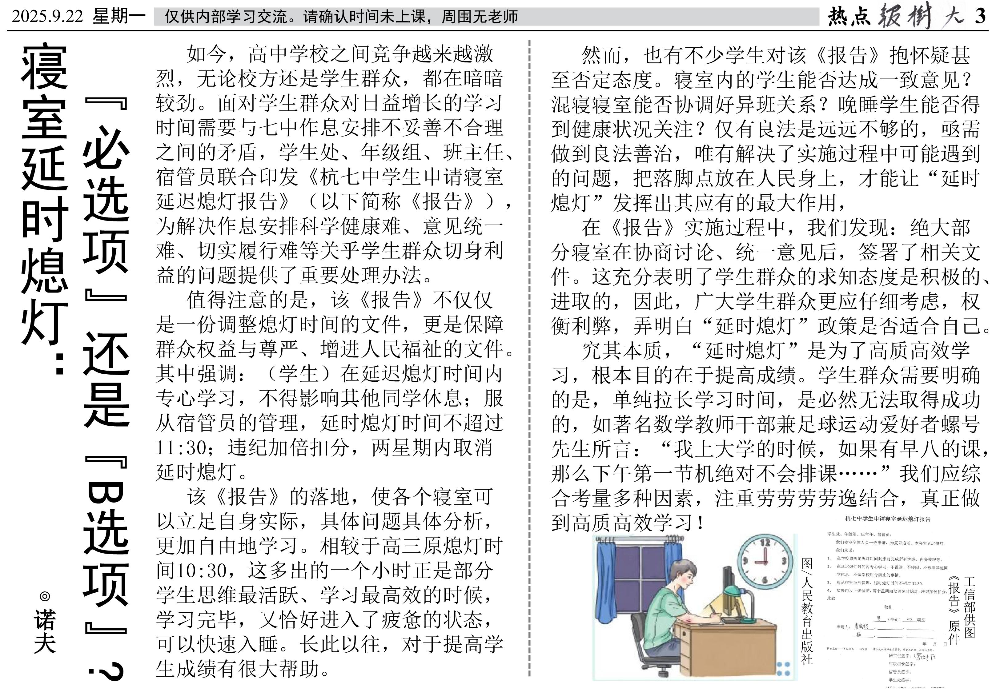
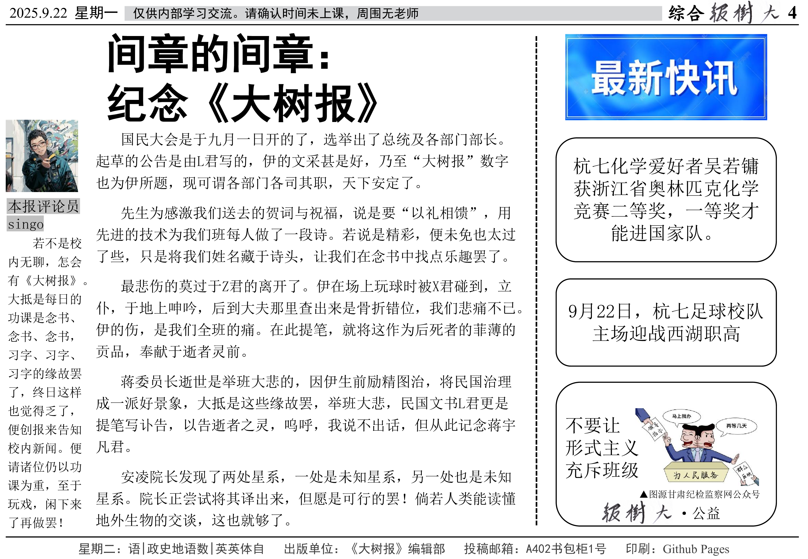

# 第2期
2025年9月22日 星期一 农历乙巳年八月初一
::: details 今日4版
文章数：4（不含快讯/广告）

字符数：2561（不含页眉页脚）

图片数：8
:::
:::info 倒计时 & 课表预报
回家4天 月考17天 一模43天 首考106天 高考258天

星期二：语|政史地语数|英英体自
:::
## 1版：要闻
### 大总统逝世 全国人民沉痛哀悼
@中華民國國民政府

字符数：213

图片数：1

## 2版：科技
### 来自地外文明的电报：接收地竟然是地球？
@安凌

字符数：883

图片数：1

## 3版：热点
### 寝室延时熄灯：“必选项”还是“B选项”?
@诺夫

字符数：850

图片数：2

## 4版：综合
### 间章的间章：纪念《大树报》
@星火Singo

字符数：533

图片数：1
### 最新快讯
@《大树报》编辑部

字符数：82

图片数：3
